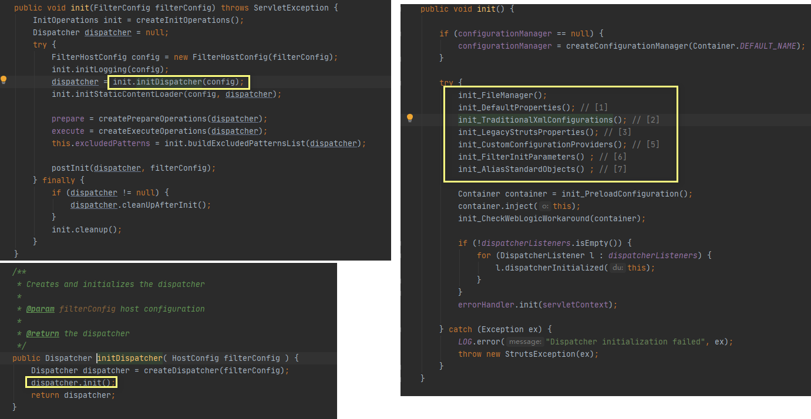

[TOC]

# Struts2概述入门

# Struts2概述

1. 基于MVC设计模式的Web应用框架, 它本质是一个servlet.
2. Struts作为Controller来建立与web层的数据交互;
3. 它基于WebWork框架, 使用Filter为入口,拦截器进行一些前置处理, 使用acion处理逻辑;

## 优势

1. •	项目开源，使用及拓展方便，天生优势。
2. 
•	提供Exception处理机制。
3. 
•	Result方式的页面导航，通过Result标签很方便的实现重定向和页面跳转。

4. •	通过简单、集中的配置来调度业务类，使得配置和修改都非常容易。
5. 
•	提供简单、统一的表达式语言来访问所有可供访问的数据。
6. 
•	提供标准、强大的验证框架和国际化框架。

7. •	提供强大的、可以有效减少页面代码的标签。

8. •	提供良好的Ajax支持。
9. 
•	拥有简单的插件，只需放入相应的JAR包，任何人都可以扩展Struts2框架，比如自定义拦截器、
自定义结果类型、自定义标签等，为Struts定制需要的功能，不需要什么特殊配置，并且可以
发布给其他人使用。
10. •	拥有智能的默认设置，不需要另外进行繁琐的设置。使用默认设置就可以完成大多数项目程序
开发所需要的功能。
上面列举的就是Struts2的一系列技术优势，只需对它们简单了解即可，在学习了后面的知识后,
会慢慢对这些技术优势有更好的理解和体会。
那么除了 Struts2之外，还有那些优秀的WEB层框架呢？

## Struts2处理流程


# Struts2快速入门

## idea创建Maven web项目


## pro.xml文件配置

```xml
<!--  版本控制-->
  <properties>
    <project.build.sourceEncoding>UTF-8</project.build.sourceEncoding>
    <maven.compiler.source>1.8</maven.compiler.source>
    <maven.compiler.target>1.8</maven.compiler.target>
    <struts2.version>2.5.16</struts2.version>
    <junit.version>4.11</junit.version>
    <servlet.version>4.0.1</servlet.version>
    <srvletPage.version>2.3.3</srvletPage.version>
  </properties>

<dependencies>
<!--    log-->
    <dependency>
      <groupId>org.apache.logging.log4j</groupId>
      <artifactId>log4j-core</artifactId>
      <version>2.10.0</version>
    </dependency>
<!--    junit-->
    <dependency>
      <groupId>junit</groupId>
      <artifactId>junit</artifactId>
      <version>${junit.version}</version>
      <scope>test</scope>
    </dependency>
<!--    struts2-core-->
    <dependency>
      <groupId>org.apache.struts</groupId>
      <artifactId>struts2-core</artifactId>
      <version>${struts2.version}</version>
    </dependency>
<!--    servlet-->
    <dependency>
      <groupId>javax.servlet</groupId>
      <artifactId>javax.servlet-api</artifactId>
      <version>${servlet.version}</version>
      <scope>provided</scope>
    </dependency>
<!--    jspPage-->
    <dependency>
      <groupId>javax.servlet.jsp</groupId>
      <artifactId>javax.servlet.jsp-api</artifactId>
      <version>${srvletPage.version}</version>
      <scope>provided</scope>
    </dependency>
  </dependencies>

<!--  构建插件和导入src中的配置文件, 编译版本控制-->
  <build>
    <finalName>Struts01_quickStart</finalName>
    <resources>
      <resource>
        <directory>src/main/resources</directory>
        <includes>
          <include>**/*.properties</include>
          <include>**/*.xml</include>
          <include>**/*.xls</include>
          <include>**/*.xlsx</include>
        </includes>
        <filtering>true</filtering>
      </resource>
      <resource>
        <directory>src/main/java</directory>
        <includes>
          <include>**/*.properties</include>
          <include>**/*.xml</include>
        </includes>
        <filtering>true</filtering>
      </resource>
    </resources>
    <pluginManagement><!-- lock down plugins versions to avoid using Maven defaults (may be moved to parent pom) -->
      <plugins>
        <plugin>
          <artifactId>maven-clean-plugin</artifactId>
          <version>3.1.0</version>
        </plugin>
        <!-- see http://maven.apache.org/ref/current/maven-core/default-bindings.html#Plugin_bindings_for_war_packaging -->
        <plugin>
          <artifactId>maven-resources-plugin</artifactId>
          <version>3.0.2</version>
        </plugin>
        <plugin>
          <artifactId>maven-compiler-plugin</artifactId>
          <version>3.8.0</version>
        </plugin>
        <plugin>
          <artifactId>maven-surefire-plugin</artifactId>
          <version>2.22.1</version>
        </plugin>
        <plugin>
          <artifactId>maven-war-plugin</artifactId>
          <version>3.2.2</version>
        </plugin>
        <plugin>
          <artifactId>maven-install-plugin</artifactId>
          <version>2.5.2</version>
        </plugin>
        <plugin>
          <artifactId>maven-deploy-plugin</artifactId>
          <version>2.8.2</version>
        </plugin>
      </plugins>
    </pluginManagement>
  </build>
```

## 配置前端过滤器(web.xml)

```xml-dtd
<!DOCTYPE web-app PUBLIC
 "-//Sun Microsystems, Inc.//DTD Web Application 2.3//EN"
 "http://java.sun.com/dtd/web-app_2_3.dtd" >

<web-app>
  <display-name>Archetype Created Web Application</display-name>
  <filter>
    <filter-name>struts2</filter-name>
    <filter-class>org.apache.struts2.dispatcher.filter.StrutsPrepareAndExecuteFilter</filter-class>
  </filter>
  <filter-mapping>
    <filter-name>struts2</filter-name>
    <url-pattern>/*</url-pattern>
  </filter-mapping>
</web-app>
```


## 第一个Action类

```java
package top.blueli.controller;

import com.opensymphony.xwork2.ActionSupport;
//最好继承ActionSupport, 后面具体介绍
public class Action extends ActionSupport {
    @Override
    public String execute() throws Exception {
        //方法作为逻辑处理单元
        System.out.println("action处理中...");
        return SUCCESS;
    }
}
```

## Action访问路径配置(Struts2配置文件)

```xml-dtd
<?xml version="1.0" encoding="UTF-8" ?>
<!DOCTYPE struts PUBLIC
        "-//Apache Software Foundation//DTD Struts Configuration 2.5//EN"
        "http://struts.apache.org/dtds/struts-2.5.dtd">
<struts>
    <package name="package1" namespace="/" extends="struts-default">
        <action name="action" class="top.blueli.controller.Action" method="execute">
            <result>/result.jsp</result>
        </action>
    </package>
</struts>
```

## jspPage配置

```jsp
index.page
<%--
  Created by IntelliJ IDEA.
  User: 19146
  Date: 2020/6/17
  Time: 20:30
  To change this template use File | Settings | File Templates.
--%>
<%@ page contentType="text/html;charset=UTF-8" language="java" %>
<html>
<head>
    <title>欢迎</title>
</head>
<body>
<h1><a href="<%=request.getContextPath()+"/action"%>">访问action类</a></h1>
</body>
</html>

result.jsp
<%--
  Created by IntelliJ IDEA.
  User: 19146
  Date: 2020/6/17
  Time: 20:30
  To change this template use File | Settings | File Templates.
--%>
<%@ page contentType="text/html;charset=UTF-8" language="java" %>
<html>
<head>
    <title>Title</title>
</head>
<body>
<h1>结果页面....</h1>
</body>
</html>

```


## 访问Action


# Struts2配置文件

1. 客户端通过前端控制器org.apache.struts2.dispatcher.filter.StrutsPrepareAndExecuteFilter;
2. 它有两个功能, 加载配置文件(init()方法)和执行拦截器组完成部分功能;

## 配置文件加载顺序



1. init_DefaultProperties: 加载默认的常量配置;
2. init_TraditionXmlconfigurations: 加载struts-default.xml, struts-plugin.xml, struts.xml
3. init_LegacyStrutsProperties: 加载用户自定义: struts.properties文件
4. init_CustomConfigurationProviders: 加载用户配置提供的对象;
5. init_FilterInitParameters: 加载web.xml
6. init_AliasStandardObjects: 加载标准对象;

## 映射配置概述(package, action)

```xml-dtd
<?xml version="1.0" encoding="UTF-8" ?>
<!DOCTYPE struts PUBLIC
        "-//Apache Software Foundation//DTD Struts Configuration 2.5//EN"
        "http://struts.apache.org/dtds/struts-2.5.dtd">
<struts>
    <package name="package1" namespace="/" extends="struts-default">
        <action name="action" class="top.blueli.controller.Action" method="execute">
            <result>/result.jsp</result>
        </action>
    </package>
</struts>
```

### package标签

1. 用于配置多个Action, 拦截器, 多个连接器引用的集合;

| 属性 | 是否必须 | 说明 |
| ---- | ---- | ---- |
| name | 必须 | 指定package的名称, 此名字作为其他包引用的key |
| nameSpace | 可选(默认"") | 他与action标签的name决定了访问位置;<br />> 默认为: "/"<br />> 根名称空间的"/"<br />> 带名称空间: "/demo1" |
| extends | 可选(一般填写struts-default) | 它可以继承package的拦截器, action定义; |
| abstract | 默认(false) | 定义为true, 那么它不能定义action访问; |

### action标签

1. 映射配置通过此配置可以使用url访问action处理单元

| 属性      | 是否可选            | 说明                   |
| --------- | ------------------- | ---------------------- |
| name      | 必填                | 表示action访问的url    |
| class     | 可选(默认Action类)  | action的pojo类         |
| method    | 可选(默认execute()) | action的执行的方法     |
| converter | 可选                | 指定类型转换器对应的类 |

## 常量配置

### 常量配置文件

1. struts.xml文件使用<constant>标签
2. struts.properties文件
3. web.xml文件配置<init-param>

```xml-dtd
<?xml version="1.0" encoding="UTF-8" ?>
<!DOCTYPE struts PUBLIC
        "-//Apache Software Foundation//DTD Struts Configuration 2.5//EN"
        "http://struts.apache.org/dtds/struts-2.5.dtd">
<struts>
	<!--配置默认字符集为UTF-8-->
	<constant name="struts.i18n.encoding" value="UTF-8"/>
	<!--配置开启开发模式-->
	<constant name="struts.devMode" value="true"/>
	<!--设置action请求的拓展名-->
	<constant name="struts.action.extension" value="action,do"/>
	<!--配置开启动态方法调用-->
	<constant name="struts.enable.DynamicMethodInvocation" value="false"/>
    <package name="package1" namespace="/" extends="struts-default">
        <action name="action" class="top.blueli.controller.Action" method="execute">
            <result>/result.jsp</result>
        </action>
    </package>
</struts>
```

```properties
###配置默认字符集为UTF-8
struts.i18n.encoding=UTF-8
###配置开启开发模式-->
struts.devMode=true
###设置action请求的拓展名-->
struts.action.extension=action,do
###配置开启动态方法调用-->
struts.enable.DynamicMethodInvocation=false
```

```xml-dtd
<!DOCTYPE web-app PUBLIC
 "-//Sun Microsystems, Inc.//DTD Web Application 2.3//EN"
 "http://java.sun.com/dtd/web-app_2_3.dtd" >

<web-app>
  <display-name>Archetype Created Web Application</display-name>
  <filter>
    <filter-name>struts2</filter-name>
    <filter-class>org.apache.struts2.dispatcher.filter.StrutsPrepareAndExecuteFilter</filter-class>
	<!--通过init-param元素配置struts2常量, 配置默认编码为UTF-8-->
	<init-param>
		<param-name>struts.i18n.encoding</param-name>
		<param-value>UTF-8</param-value>
	</init-param>
  </filter>
  <filter-mapping>
    <filter-name>struts2</filter-name>
    <url-pattern>/*</url-pattern>
  </filter-mapping>
</web-app>
```

> <b>注意文件的加载顺序, 后加载的配置会覆盖前面的配置</b>(struts.xml, struts.properties, web.xml)

## 分模块开发配置

```xml-dtd
<?xml version="1.0" encoding="UTF-8" ?>
<!DOCTYPE struts PUBLIC
        "-//Apache Software Foundation//DTD Struts Configuration 2.5//EN"
        "http://struts.apache.org/dtds/struts-2.5.dtd">
<struts>
	<!--配置默认字符集为UTF-8-->
	<constant name="struts.i18n.encoding" value="UTF-8"/>
	<!--配置开启开发模式-->
	<constant name="struts.devMode" value="true"/>
	<!--设置action请求的拓展名-->
	<constant name="struts.action.extension" value="action,do"/>
	<!--配置开启动态方法调用-->
	<constant name="struts.enable.DynamicMethodInvocation" value="false"/>
    <package name="package1" namespace="/" extends="struts-default">
        <action name="action" class="top.blueli.controller.Action" method="execute">
            <result>/result.jsp</result>
        </action>
    </package>

<!--分模块开发-->
<!--不指定路径在src下-->
<include file="struts-shop.xml"/>
<include file="struts-user.xml"/>
<!--带路径的访问-->
<include file="top/blueli/action/conf/user.xml"/>
</struts>
```


# Action类实现与访问

## Action类编写

#### 普通的pojo类

1. Action不需要继承任何接口, 仅仅是一个POJO(Plain Ordinary Java Object), 具有部分getter/setter方法的类, 有无参钩爪函数;

```java
package top.blueli.cotroller

public class Action(){
	public String action(){
		return "success";
	}
}
```

#### 实现Action接口

1. 它定义了action的规范;
2. execute()方法规范
   1. 使用public修饰
   2. 返回一个字符串
   3. 方法没有参数
3. 定义了5个常量: SUCCESS(成功), NONE(跳转不成功), ERROR(跳转到错位于页面), INPUT(数据校验跳转的路径), LOGIN(用来跳转登入);

```java
package top.blueli.controller;

import static com.opensymphony.xwork2.Action.SUCCESS;
public class Action implements com.opensymphony.xwork2.Action {
    @Override
    public String execute() throws Exception {
        //方法作为逻辑处理单元
        System.out.println("action处理中...");
        return SUCCESS;
    }
}
```

#### 继承ActionSupport类

1. 实现了Action接口
2. 同时实现了: Validatable, ValidationAware, TextProvider, LocaleProvider, Serializable接口
3. 有许多默认方法: 获取国际化信息, 数据校验的方法, 默认处理用户请求的方法;

```java
package top.blueli.controller;

import com.opensymphony.xwork2.ActionSupport;

public class Action extends ActionSupport {
    @Override
    public String execute() throws Exception {
        //方法作为逻辑处理单元
        System.out.println("action处理中...");
        return SUCCESS;
    }
}
```

## Action访问

### 问题

1. 访问action中的多个方法(action类, 与映射配置)

```java
package top.blueli.controller;

import com.opensymphony.xwork2.ActionSupport;

public class Action extends ActionSupport {
    @Override
    public String execute() throws Exception {
        //方法作为逻辑处理单元
        System.out.println("action处理中...");
        return SUCCESS;
    }

    public String login() {
        System.out.println("登入");
        return SUCCESS;
    }
    public String register() {
        System.out.println("注册");
        return SUCCESS;
    }
    public String loginOut() {
        System.out.println("登出");
        return SUCCESS;
    }
}

```

2. 映射配置复杂, 需要配置多个action标签

```xml-dtd
<?xml version="1.0" encoding="UTF-8" ?>
<!DOCTYPE struts PUBLIC
        "-//Apache Software Foundation//DTD Struts Configuration 2.5//EN"
        "http://struts.apache.org/dtds/struts-2.5.dtd">
<struts>
    <!--配置默认字符集为UTF-8-->
    <constant name="struts.i18n.encoding" value="UTF-8"/>
    <!--配置开启开发模式-->
    <constant name="struts.devMode" value="true"/>
    <!--设置action请求的拓展名-->
    <constant name="struts.action.extension" value="action,do,"/>
    <!--配置开启动态方法调用-->
    <constant name="struts.enable.DynamicMethodInvocation" value="false"/>
    <package name="package1" namespace="/" extends="struts-default">
        <action name="execute" class="top.blueli.controller.Action" method="execute">
            <result>/result.jsp</result>
        </action>
        <action name="login" class="top.blueli.controller.Action" method="login">
            <result>/result.jsp</result>
        </action>
        <action name="register" class="top.blueli.controller.Action" method="register">
            <result>/result.jsp</result>
        </action>
        <action name="loginOut" class="top.blueli.controller.Action" method="loginOut">
            <result>/result.jsp</result>
        </action>
    </package>
</struts>
```

### 通过通配符访问action

1. 使用通配符配置action, 使得一个action标签匹配多个方法;
2. 配置action, 使用痛通配符;
3. 使用nameVaklue_methodName访问;

```xml-dtd
<?xml version="1.0" encoding="UTF-8" ?>
<!DOCTYPE struts PUBLIC
        "-//Apache Software Foundation//DTD Struts Configuration 2.5//EN"
        "http://struts.apache.org/dtds/struts-2.5.dtd">
<struts>
    <!--配置默认字符集为UTF-8-->
    <constant name="struts.i18n.encoding" value="UTF-8"/>
    <!--配置开启开发模式-->
    <constant name="struts.devMode" value="true"/>
    <!--设置action请求的拓展名-->
    <constant name="struts.action.extension" value="action,do,"/>
    <!--配置开启动态方法调用-->
    <constant name="struts.enable.DynamicMethodInvocation" value="false"/>
    <package name="package1" namespace="/" extends="struts-default">
        <action name="execute" class="top.blueli.controller.Action" method="execute">
            <result>/result.jsp</result>
        </action>
        <action name="login" class="top.blueli.controller.Action" method="login">
            <result>/result.jsp</result>
        </action>
        <action name="register" class="top.blueli.controller.Action" method="register">
            <result>/result.jsp</result>
        </action>
        <action name="loginOut" class="top.blueli.controller.Action" method="loginOut">
            <result>/result.jsp</result>
        </action>
    </package>

<!--    使用痛通配符的方式访问Action方法
		method可以截取前面的name的参数, 即可访问action;
-->
    <package name="package2" extends="struts-default" namespace="/">
        <action name="action_*" class="top.blueli.controller.Action" method="{1}">
            <result>/result.jsp</result>
        </action>
    </package>
</struts>
```

### 通过动态方法访问action

1. 开启动态方法调用
2. 配置package子标签: <global-allowed-methods>regex:.*</global-allowed-methods>
3. 使用nameValue!methodName, 形式访问页面;

```xml-dtd
<?xml version="1.0" encoding="UTF-8" ?>
<!DOCTYPE struts PUBLIC
        "-//Apache Software Foundation//DTD Struts Configuration 2.5//EN"
        "http://struts.apache.org/dtds/struts-2.5.dtd">
<struts>
    <!--配置默认字符集为UTF-8-->
    <constant name="struts.i18n.encoding" value="UTF-8"/>
    <!--配置开启开发模式-->
    <constant name="struts.devMode" value="true"/>
    <!--设置action请求的拓展名-->
    <constant name="struts.action.extension" value="action,do,"/>
    <!--配置开启动态方法调用-->
    <constant name="struts.enable.DynamicMethodInvocation" value="true"/>
    <package name="package1" namespace="/" extends="struts-default">
        <action name="execute" class="top.blueli.controller.Action" method="execute">
            <result>/result.jsp</result>
        </action>
        <action name="login" class="top.blueli.controller.Action" method="login">
            <result>/result.jsp</result>
        </action>
        <action name="register" class="top.blueli.controller.Action" method="register">
            <result>/result.jsp</result>
        </action>
        <action name="loginOut" class="top.blueli.controller.Action" method="loginOut">
            <result>/result.jsp</result>
        </action>
    </package>

<!--    使用痛通配符的方式访问Action方法-->
<!--    <package name="package2" extends="struts-default" namespace="/">-->
<!--        <action name="action_*" class="top.blueli.controller.Action" method="{*}">-->
<!--            <result>/result.jsp</result>-->
<!--        </action>-->
<!--    </package>-->

<!--   动态方法调用 
		注意2.5版本需要配置global-allowed-methods标签
-->
    <package name="package3" extends="struts-default" namespace="/">
        <global-allowed-methods>regex:.*</global-allowed-methods>
        <action name="user" class="top.blueli.controller.Action">
            <result>/result.jsp</result>
        </action>
    </package>
</struts>
```
