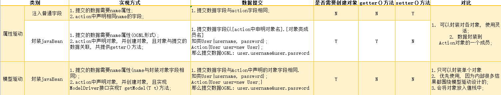
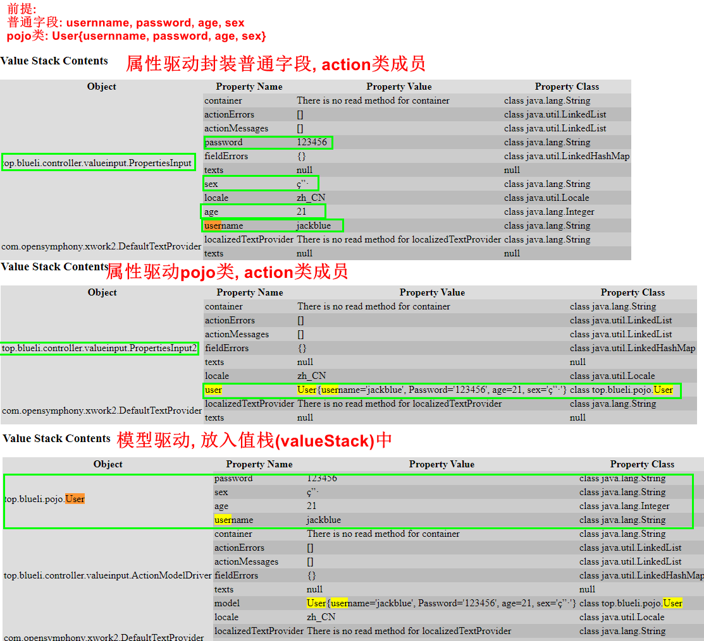

[TOC]

# struts2访问Servlet API

1. Struts2的action处理单元没有直接与action耦合, 也就是所在Struts2的action不能直接访问ServletAPI;
2. 优点: 可以方便的进行单元测试;

## ActionContext类访问

1. 它代表了当前线程绑定的的上下文环境, 并且保存了Action执行所需要的对象包括: parameters, request, session, application等;
2. 简介

```java
public class ActionContext
extends Object
implements Serializable
The ActionContext is the context in which an Action is executed. Each context is basically a container of objects an action needs for execution like the session, parameters, locale, etc.

The ActionContext is thread local which means that values stored in the ActionContext are unique per thread. See the ThreadLocal class for more information. The benefit of this is you don't need to worry about a user specific action context, you just get it:

ActionContext context = ActionContext.getContext();
Finally, because of the thread local usage you don't need to worry about making your actions thread safe.

Author:
Patrick Lightbody, Bill Lynch (docs)
See Also:
Serialized Form
```

3. 常用API

| Num  | Modifier and Type    | Field and Description                                        |
| ---- | -------------------- | ------------------------------------------------------------ |
| 1    | static ActionContext | getContext()<br />Returns the ActionContext specific to the current Thread. |
| 2    | Object               | get(String key)<br />Returns a value that is stored in the current ActionContext by doing a lookup using the value's key. |
| 3    | void                 | put(String key, Object value)<br />Stores a value in the current ActionContext. |
| 4    | Local                | getLocale()<br />Gets the Locale of the current Action.      |
| 6    | String               | getName()<br />Gets the name of current Action.              |
| 7    | HttpParameters       | getParameters()<br />Returns a Map of the HttpServletRequest parameters when in a servlet environment or a generic Map of parameters otherwise. |
| 8    | Map<String, Object>  | getApplication()<br />Returns a Map of the ServletContext when in a servlet environment or a generic application level Map otherwise. |
| 9    | Map<String, Object>  | getSession()<br />Gets the Map of HttpSession values when in a servlet environment or a generic session map otherwise. |
| 10   | ValueStack           | getValueStack()<br />Gets the OGNL value stack.              |
|      |                      |                                                              |

1. 获取此API对象可以使用类方法, static getContext()获得;
2. 它可以获取值栈, 关于当前action的信息;
3. 可以访问提交的数据get/post, 可以获取Session, Application的Map类型对象;

### 获取用户提交的参数

1. 使用7号方法获取HttpParameters对象来获取提交的参数;
   1. 它封装了所有用户提交的数据, 以key-value保存; 
   2. value的形式为Parameter接口;

```java
package top.blueli.controller;

import com.opensymphony.xwork2.ActionContext;
import com.opensymphony.xwork2.ActionSupport;
import org.apache.struts2.dispatcher.HttpParameters;
import org.apache.struts2.dispatcher.Parameter;

import java.util.Collection;

public class Action extends ActionSupport {
    @Override
    public String execute() {
        ActionContext actionContext = ActionContext.getContext();
        //获取代表参数的HttpParameters对象
        HttpParameters httpParameters = actionContext.getParameters();
        //获取输出的参数个数
        System.out.println("用户提交了多少个参数: "+ httpParameters.size());
        Collection<Parameter> values = httpParameters.values();
        System.out.println("参数为:");
        for(Parameter value: values) {
            System.out.println(value.getName() + ":" + value.getValue());
        }
        return SUCCESS;
    }

}
//接口测试使用idea http client
POST http://localhost:8080/StrutsDay02_servletAndValueInput_war_exploded/action1_execute
Content-Type: application/x-www-form-urlencoded

username=userName&password=123456&nikName=jacklblue
//控制台输出
用户提交了多少个参数: 3
参数为:
nikName:jacklblue
password:123456
username:userName
```

2. HttpParameters常用API

```java
public class HttpParameters
extends Object
implements Map<String,Parameter>, Cloneable
    //它继承了map集合, 值以key-value的形式保存, 可以方式的获取提交的get/post参数;
```

| Num  | Modifier and Type                 | Method and Desciption                                |
| ---- | --------------------------------- | ---------------------------------------------------- |
| 1    | boolean                           | <b>isEmpty()</b>                                     |
| 2    | boolean                           | contains(String name)                                |
| 3    | boolean                           | containsKey(Object key)                              |
| 4    | set<Map.Entry<String, Parameter>> | entrySet()                                           |
| 5    | Parameter                         | <b>get(Object key)</b>                               |
| 6    | Set<String>                       | <b>keySet()</b>                                      |
| 7    | Parameter                         | put(String key, Parameter value)                     |
| 8    | void                              | putAll(Map<? extends String, ? extends Parameter> m) |
| 9    | Parameter                         | <b>remove(Object key)</b>                            |
| 10   | HttpParameter                     | remove(Set<String> paramsToRemove)                   |
| 11   | HttpParameter                     | remove(String paramToRemove)                         |
| 12   | int                               | <b>size()</b>                                        |
| 13   | String                            | toString()                                           |
| 14   | Collection<Parameter>             | values()                                             |

3. 它返回的都是Parameter对象, 他是一个接口;

```java
boolean	contains(String name) 
All Known Implementing Classes:
Parameter.Empty, Parameter.File, Parameter.Request
```

| Num  | Modifier and Type | Method and Description |
| ---- | ----------------- | ---------------------- |
| 1    | String[]          | getMultipleValue();    |
| 2    | String            | getName();             |
| 3    | Object            | getObject();           |
| 4    | String            | getValue();            |

### 获取Session与Application域对象

1. Map<String, Object> getSession() || getApplication对象
   1. 使用此方法将两大域对象封装称为Map;

```java
------------------------------------------------------客户端请求------------------------------------------------------------------
POST http://localhost:8080/StrutsDay02_servletAndValueInput_war_exploded/action1_execute
Content-Type: application/x-www-form-urlencoded


--------------------------------------------------action类与映射配置--------------------------------------------------------------

package top.blueli.controller;

import com.opensymphony.xwork2.ActionContext;
import com.opensymphony.xwork2.ActionSupport;
import org.apache.struts2.dispatcher.HttpParameters;
import org.apache.struts2.dispatcher.Parameter;

import java.util.Collection;
import java.util.Map;

public class Action extends ActionSupport {
    @Override
    public String execute() {
        ActionContext actionContext = ActionContext.getContext();
        //获取代表参数的HttpParameters对象
        HttpParameters httpParameters = actionContext.getParameters();
        Parameter parameter = httpParameters.get("");
        System.out.println("用户提交了多少个参数: "+ httpParameters.size());
        Collection<Parameter> values = httpParameters.values();
        System.out.println("参数为:");
        for(Parameter value: values) {
            System.out.println(value.getName() + ":" + value.getValue());
        }

        //获取Session, Application两大域对象封装的Map<String, Object>;
        Map<String, Object> session = actionContext.getSession();
        session.put("session", "ActionContextGetSessionObjectValue");
        Map<String, Object> application = actionContext.getApplication();
        application.put("application", "ActionContextGetSessionObjectValue");
        return SUCCESS;
    }
}
//映射配置
<package name="package1" extends="struts-default" namespace="/">
        <action name="action1_*" class="top.blueli.controller.Action" method="{*}">
            <result>/result.jsp</result>
        </action>
</package>
---------------------------------------------------jsp页面-----------------------------------------------------------------

//jsp页面获取两大域对象
<ul>
    <li>EL SessionScope: 访问SessionScope: ${sessionScope.session}</li>
    <li>OGNL SessionScope: 访问SessionScope: <s:property default="defaultValue" value="%{#session.session}"/></li>

    <li>EL Application: 访问Application: ${applicationScope.application}</li>
    <li>OGNL Application: 访问Application: <s:property default="defaultValue" value="%{#application.application}"/></li>
</ul>
---------------------------------------------------运行结果-----------------------------------------------------------------
//jsp页面响应结果
<ul>
    <li>EL SessionScope: 访问SessionScope: ActionContextGetSessionObjectValue</li>
    <li>OGNL SessionScope: 访问SessionScope: ActionContextGetSessionObjectValue</li>

    <li>EL Application: 访问Application: ActionContextGetSessionObjectValue</li>
    <li>OGNL Application: 访问Application: ActionContextGetSessionObjectValue</li>
</ul>

```

### 其他API

1. 还有一个特备重要的对象即ValueStack对象, 他是struts2的一个重要对象;

## ServletXxxAware接口访问

1. 通过实现接口: ServletRequestAware, ServeltResponseAware, SessionAware, ServeltContextAware可以方便的访问web的request, response, session, application对象;
2. 通过实现接口, 实现setServletXXX()方法即可在action中访问ServletAPI;

```java
------------------------------------------------------客户端请求------------------------------------------------------------------
//http clent访问API
POST http://localhost:8080/StrutsDay02_servletAndValueInput_war_exploded/action2_execute
Content-Type: application/x-www-form-urlencoded
--------------------------------------------------action类与映射配置--------------------------------------------------------------

//action类
package top.blueli.controller;

import com.opensymphony.xwork2.ActionSupport;
import org.apache.struts2.interceptor.ServletRequestAware;
import org.apache.struts2.interceptor.ServletResponseAware;
import org.apache.struts2.interceptor.SessionAware;
import org.apache.struts2.util.ServletContextAware;

import javax.servlet.*;
import javax.servlet.http.*;
import java.util.Map;
//通过继承接口即可获取核心api;
public class ServletAboutInterface extends ActionSupport implements ServletRequestAware, ServletResponseAware, SessionAware, ServletContextAware {
    private ServletRequest request;
    private ServletResponse response;
    private Map<String, Object> sessionMap;
    private ServletContext servletContext;

    //这里是获取servletapi的关键
    @Override
    public void setServletRequest(HttpServletRequest request) {
        this.request = request;
    }

    @Override
    public void setServletResponse(HttpServletResponse response) {
        this.response = response;
    }

    @Override
    public void setSession(Map<String, Object> session) {
        this.sessionMap = session;
    }

    @Override
    public void setServletContext(ServletContext context) {
        this.servletContext = context;
    }

    @Override
    public String execute() throws Exception {
        request.setAttribute("requestScopeKey", "requestScopeObjectValue");
        sessionMap.put("sessionScopeKey", "sessionScopeObjectValue");
        servletContext.setAttribute("servletContextKey", "sessionScopeObjectValue");
        return SUCCESS;
    }

}

//映射配置
    <package name="package1" extends="struts-default" namespace="/">
        <action name="action2_*" class="top.blueli.controller.ServletAboutInterface" method="{*}">
            <result>/result.jsp</result>
        </action>
    </package>
            
---------------------------------------------------jsp页面-----------------------------------------------------------------


//结果页面, resultSet.jsp
<h1>使用接口的在action中获取ServletApi, 并操作;</h1>
<ul>
    <li>EL: Request: ${requestScopeKey}</li>
    <li>OGNL:  Response: <s:property default="defaultValue" value="%{#request.requestScopeKey}"/></li>
    <li>EL: session: ${sessionScopeKey}</li>
    <li>OGNL:  session: <s:property default="defaultValue" value="%{#session.sessionScopeKey}"/></li>
    <li>EL: application: ${servletContextKey}
    <li>OGNL:  application: <s:property default="defaultValue" value="%{#application.servletContextKey}"/></li>
</ul>
---------------------------------------------------运行结果-----------------------------------------------------------------

//运行结果
<ul>
    <li>EL: RequestrequestScopeObjectValue</li>
    <li>OGNL:  Response defaultValue</li>
    <li>EL: sessionsessionScopeObjectValue</li>
    <li>OGNL:  session defaultValue</li>
    <li>EL: application</li>
    <li>OGNL:  application defaultValue</li>
</ul>
```


## ServletActionContext静态方法访问

1. 他继承了ActionContext接口, 所以可以使用Action中的方法;
2. 通过此类的Servlet API, 可以使用简单的类方法获取数据结构;

```java
public class ServletActionContext
extends ActionContext
implements StrutsStatics
Web-specific context information for actions. This class subclasses ActionContext which provides access to things like the action name, value stack, etc. This class adds access to web objects like servlet parameters, request attributes and things like the HTTP session.
```

| Modifier and Type                                  | Method and Description                                       |
| -------------------------------------------------- | ------------------------------------------------------------ |
| `static ActionContext`                             | `getActionContext(javax.servlet.http.HttpServletRequest req)`Gets the current action context |
| static ActionMapping                               | getActionMapping()<br />Gets the action mapping for this context |
| static<br />javax.servlet.http.HttpServletRequest  | getRequest()<br />Gets the HTTP servelt request object.      |
| static<br />javax.servlet.http.HttpServletResponse | getResponse()<br />Gets the HTTP servelt response object.    |
| static<br /> javax.servelt.http.ServletContext     | getServletContext()<br />Gets the HTTP servelt request object. |
| static<br />javax.servelt.jsp.PageContext          | getPageContext()<br />Retuens the HTTP page context          |
| Static ActionContext                               | getActionContext(javax.servlet.http.HttpServletRequest req)<br />Gets the current action context |
| Static ActionMapping<br />封装了action的信息       | getActionMapping()<br />Gets the action mapping for this context; |
| Static ValueStack                                  | getValueStack(javax.servlet.http.HttpServletRequest request)<br />Gets the current value stack for this request; |

#### 获取核心Servlet案例

```java
------------------------------------------------------客户端请求------------------------------------------------------------------

//Http Client
POST http://localhost:8080/StrutsDay02_servletAndValueInput_war_exploded/action3_execute
Content-Type: application/x-www-form-urlencoded

--------------------------------------------------action类与映射配置--------------------------------------------------------------
//action类
package top.blueli.controller;

import com.opensymphony.xwork2.ActionSupport;
import org.apache.struts2.ServletActionContext;

import javax.servlet.ServletContext;
import javax.servlet.http.HttpServletRequest;
import javax.servlet.http.HttpServletResponse;
import java.util.Map;

public class ServletAboutServletActionContext extends ActionSupport {
    @Override
    public String execute() throws Exception {
        //使用ServletActionContext获取web4大域对象
        //他继承于ActionContext类;
        HttpServletRequest request = ServletActionContext.getRequest();
        HttpServletResponse response = ServletActionContext.getResponse();
        //这里需要通过ActionContext对象获得代表session的Map;
        Map<String, Object> sessionMap = ServletActionContext.getActionContext(request).getSession();
        ServletContext application = ServletActionContext.getServletContext();

        request.setAttribute("requestScopeKey", "requestScopeObjectValue");
        sessionMap.put("sessionScopeKey", "sessionScopeObjectValue");
        application.setAttribute("servletContextKey", "sessionScopeObjectValue");

        return super.execute();
    }
}
//映射配置文件
<package name="package1" extends="struts-default" namespace="/">
        <action name="action3_*" class="top.blueli.controller.ServletAboutServletActionContext" method="{*}">
            <result>/result.jsp</result>
        </action>
</package>
---------------------------------------------------jsp页面-----------------------------------------------------------------
//结构页面result.jsp
<h1>使用ServletActionContext获取ServletApi, 并操作;</h1>
<ul>
    <li>EL: Request: ${requestScopeKey}</li>
    <li>OGNL:  Response: <s:property default="defaultValue" value="%{#request.requestScopeKey}"/></li>
    <li>EL: session: ${sessionScopeKey}</li>
    <li>OGNL:  session: <s:property default="defaultValue" value="%{#session.sessionScopeKey}"/></li>
    <li>EL: application: ${servletContextKey}
    <li>OGNL:  application: <s:property default="defaultValue" value="%{#application.servletContextKey}"/></li>
</ul>
---------------------------------------------------运行结果-----------------------------------------------------------------
//运行结果
<h1>使用ServletActionContext获取ServletApi, 并操作;</h1>
<ul>
    <li>EL: Request: requestScopeObjectValue</li>
    <li>OGNL:  Response: requestScopeObjectValue</li>
    <li>EL: session: sessionScopeObjectValue</li>
    <li>OGNL:  session: sessionScopeObjectValue</li>
    <li>EL: application: sessionScopeObjectValue
    <li>OGNL:  application: sessionScopeObjectValue</li>
</ul>
```

#  结果页面配置

1. 在struts2框架流程图, 前端控制器->拦截器链->action逻辑端元->前端控制器->view处理;
2. 所以: 需要配置在action之后的响应页面;

## 全局结构页面

1. 全局结构页面匹配在同一个包下的所有处理单元, 匹配返回值;
2. 全局页面的<b>优先级</b>低于局部的

```xml-dtd
 <package name="package1" extends="struts-default" namespace="/">
        <global-results>
            <result name="success">index.jsp</result>
        </global-results>
 </package>
```

## 局部结构页面

1. 局部结果页面即<action>中<result>标签type的值;

2. 在Struts2中封装了许多ResultType, 多种显示结构的技术;

3. 结构类型实现了com.opensymphony.xwork2.Result接口类, Struts2吧内置的<result-type>放入struts-default包中, struts2-default包就是配置包的父包, 这个包在struts2-core-xxx.jar中更目录下;

### ResultType定义\<result\>type属性

| field              | info                                                         |
| ------------------ | ------------------------------------------------------------ |
| **chain**          | 转向到Action ,处理Action链, 跳转到下一个Action中仍能获取上一个的值, 如request; |
| **dispatcher**     | 用来转向页面, 处理jsp页面, 是默认的结构类型;                 |
| **redirect**       | 从定向到一个URL, 数据丢失;                                   |
| **redirectAction** | 从定向到一个Action, 数据丢失;                                |
| stream             | 向浏览器发送InputStream对象, 通常用来处理文件下载            |
| freemarker         | 用来整合FreeMarker模板结果类型                               |
| httpheader         | 用于处理特殊的HTTP行为结构                                   |
| velocity           | 用于整合Velocity模板结构类型                                 |
| xslt               | 用于整合xslt模板结构类型                                     |
| plainText          | 显示源文件内容, 如源码                                       |
| postback           | 使得当前亲求参数以表单形式提交                               |

# 数据的封装

1. struts2通过拦截器链, aop技术, 将提交的数据进行封装, 在action中可以方便的使用这些数据;

## 属性驱动

1. 在Action中定义Java基本类型的字段;
2. 表单中的字段与Action中定义的字段名称相同;

### 基本数据类型

1. 提供字段的**set方法**;

> 使用Http client提交数据, 在action中答应提交的post数据, 在页面显示提交的数据, 代码如下;

```java
--------------------------------------------------请求部分--------------------------------------------
###属性驱动注入数据1
POST http://localhost:8080/StrutsDay02_servletAndValueInput_war_exploded/valueinput/action1_execute
Content-Type: application/x-www-form-urlencoded

username=jackblue&password=123456&age=21&sex=男

--------------------------------------------------action部分--------------------------------------------
//Action处理单元
package top.blueli.controller.valueinput;

import com.opensymphony.xwork2.ActionSupport;
//提供与表单对应的字段, 并提供setter方法;
public class PropertiesInput extends ActionSupport {
    private String username;
    private String password;
    private Integer age;
    private String sex;
    @Override
    public String execute() throws Exception {
        System.out.println("username: "+username);
        System.out.println("password: "+password);
        System.out.println("age: "+age);
        System.out.println("sex: "+sex);
        return super.execute();
    }
    //setter...
}

//映射配置
    <package name="package2" extends="struts-default" namespace="/valueinput">
        <global-results>
            <result name="success">index.jsp</result>
        </global-results>
        <action name="action1_*" class="top.blueli.controller.valueinput.PropertiesInput" method="{*}">
            <result>/valueinput/result.jsp</result>
        </action>
    </package>

--------------------------------------------------页面响应部分--------------------------------------------
//在webapp/valueinput/result.jsp的界面
<h1>基本数据类型注入action中, 并在此查看结果</h1>
<ul>
    <li>username: <s:property default="null" value="%{username}" /></li>
    <li>password: <s:property default="null" value="%{password}" /></li>
    <li>age: <s:property default="null" value="%{age}" /></li>
    <li>sex: <s:property default="null" value="%{sex}" /></li>
</ul>
--------------------------------------------------运行结果--------------------------------------------
//控制台输出数据封装信息
username: jackblue
password: 123456
age: 21
sex: 男
//页面运行结果
<h1>基本数据类型注入action中, 并在此查看结果</h1>
<ul>
    <li>username: jackblue</li>
    <li>password: 123456</li>
    <li>age: 21</li>
    <li>sex: 男</li>
</ul>
```

### 封装数据到javaBean

1. 在Action中声明javaBean并**创建对象**;
2. 页面使用Ognl表达式进行标识;

```java
//javaBean提供无参构造器, 并提供getter/setter方法
javaBean字段: User{username, password, age, sex};
//表单的name属性, 即对象名.字段名(对象名与action中创建的相同, 字段名与User类字段相同)
user.username;
user.password;
user.age;
user.sex;
```

#### 案例

```java
------------------------------------------------------User javaBean-----------------------------------------
//提供getter,setter方法, 并提供无参构造器;
package top.blueli.pojo;

public class User {
    private String username;
    private String password;
    private Integer age;
    private String sex;

    @Override
    public String toString() {
        return "User{" +
                "username='" + username + '\'' +
                ", Password='" + password + '\'' +
                ", age=" + age +
                ", sex='" + sex + '\'' +
                '}';
    }
    //getter,setter...
}
-----------------------------------------------------HTTP Client-----------------------------------------
//http请求
###属性驱动注入数据2, 使用javaBean封装
POST http://localhost:8080/StrutsDay02_servletAndValueInput_war_exploded/valueinput/action2_execute
Content-Type: application/x-www-form-urlencoded

user.username=jackblue&user.password=123456&user.age=21&user.sex=男

-----------------------------------------------------Action类-----------------------------------------
package top.blueli.controller.valueinput;

import com.opensymphony.xwork2.ActionSupport;
import top.blueli.pojo.User;

public class PropertiesInput2 extends ActionSupport {
    //一定要创建对象, 不然异常
    private User user=new User();
    @Override
    public String execute() throws Exception {
        System.out.println(user);
        return SUCCESS;
    }
	//提供get方法
    public User getUser() {
        return user;
    }
}

//映射配置
    <package name="package2" extends="struts-default" namespace="/valueinput">
        <global-results>
            <result name="success">index.jsp</result>
        </global-results>
        <action name="action2_*" class="top.blueli.controller.valueinput.PropertiesInput2" method="{*}">
            <result>/valueinput/result.jsp</result>
        </action>
    </package>
---------------------------------------------------结果页面----------------------------------------------
//在webapp/valueinput/result.jsp的界面
<h1>属性驱动, 封装javaBean到action中, 并在此查看结果</h1>
<ul>
    <li>username: <s:property default="null" value="%{user.username}" /></li>
    <li>password: <s:property default="null" value="%{user.password}" /></li>
    <li>age: <s:property default="null" value="%{usr.age}" /></li>
    <li>sex: <s:property default="null" value="%{user.sex}" /></li>
</ul>

---------------------------------------------------运行结果----------------------------------------------
//控制台
User{username='jackblue', password='123456', age=21, sex='男'}
//jsp结构页面
<h1>属性驱动, 封装javaBean到action中, 并在此查看结果</h1>
<ul>
    <li>username: jackblue</li>
    <li>password: 123456</li>
    <li>age: null</li>
    <li>sex: 男</li>
</ul>
```

## 模型驱动

1. 使用普通的pojo类作为模型来传递数据;
2. 页面提交哦字段必须与pojo类字段名相同;
3. 在Action中声明对象并创建;
4. 实现DriverMode\<T t\>接口, 并实现T getModel()方法;

```java
----------------------------------------------------------客户请求---------------------------------------------------------------
###模型驱动注入数据, 使用javaBean封装
POST http://localhost:8080/StrutsDay02_servletAndValueInput_war_exploded/valueinput/action3_execute
Content-Type: application/x-www-form-urlencoded

username=jackblue&password=123456&age=21&sex=男
--------------------------------------------------------action与配置-------------------------------------------------------------
//Action类
package top.blueli.controller.valueinput;

import com.opensymphony.xwork2.ActionSupport;
import com.opensymphony.xwork2.ModelDriven;
import top.blueli.pojo.User;

public class ActionModelDriver extends ActionSupport implements ModelDriven<User> {
    private User user = new User();
    //必须实现此方法
    @Override
    public User getModel() {
        return user;
    }
    
    @Override
    public String execute() throws Exception {
        System.out.println(user);
        return SUCCESS;
    }
}
//映射配置
    <package name="package2" extends="struts-default" namespace="/valueinput">
        <action name="action3_*" class="top.blueli.controller.valueinput.ActionModelDriver" method="{*}">
            <result>/valueinput/result.jsp</result>
        </action>
    </package>
----------------------------------------------------------jsp页面---------------------------------------------------------------
//在webapp/valueinput/result.jsp的界面
<h1>模型驱动, 数据普通数据相同</h1>
<ul>
    <li>username: <s:property default="null" value="%{username}" /></li>
    <li>password: <s:property default="null" value="%{password}" /></li>
    <li>age: <s:property default="null" value="%{age}" /></li>
    <li>sex: <s:property default="null" value="%{sex}" /></li>
</ul>
----------------------------------------------------------运行结果---------------------------------------------------------------
//action打印结果
User{username='jackblue', Password='123456', age=21, sex='男'}
//jsp运行结果
<h1>模型驱动, 数据普通数据相同</h1>
<ul>
    <li>username: jackblue</li>
    <li>password: 123456</li>
    <li>age: 21</li>
    <li>sex: 男</li>
</ul>
```

## 属性驱动与模型驱动对比, debug模式



### 数据存放位置对比



1. 属性驱动数据作为Action对象成员, 而模型驱动是将数据存放入值栈中保存;

## 集合封装

1. 封装集合使用属性驱动的方式是数据集合;
2. 提交数据使用OGNL表达式的形式封装数据
   1. list:  userList[0].[封装的对象的字段名];
   2. Map: userMap['keyValue'].[封装的对象的字段名];
3. action中声明与提交数据相同的成员, 并创建对象, 通过get方法;

### List集合的实现

```java
------------------------------------------------------客户端请求------------------------------------------------------------------
POST http://localhost:8080/StrutsDay02_servletAndValueInput_war_exploded/valueinput/action4_execute
Content-Type: application/x-www-form-urlencoded

userList[0].username=jackblue&userList[0].password=123456&userList[0].age=21&userList[0].sex=男&userList[1].username=jackblue&userList[1].password=123456&userList[1].age=21&userList[1].sex=男

--------------------------------------------------action类与映射配置--------------------------------------------------------------
//Action类
package top.blueli.controller.valueinput;

import com.opensymphony.xwork2.ActionSupport;
import com.sun.xml.internal.bind.v2.runtime.unmarshaller.XsiNilLoader;
import top.blueli.pojo.User;

import java.util.ArrayList;
import java.util.Arrays;
import java.util.List;
/**
*	1.使用的式属性驱动的方式注入数据;
    2.注意观察提交数据的格式;
    3.action中声明, 创建对象, 并提供getter()方法;
*/
public class ListCollectionInput extends ActionSupport {
    private List<User> userList = new ArrayList<User>();

    @Override
    public String execute() throws Exception {
        System.out.println(userList);
        return SUCCESS;
    }

    public List<User> getUserList() {
        return userList;
    }
}
//映射配置
<package name="package3" extends="struts-default" namespace="/valueinput">
        <global-results>
            <result name="success">index.jsp</result>
        </global-results>
        <action name="action4_*" class="top.blueli.controller.valueinput.ListCollectionInput" method="{*}">
            <result>/valueinput/result.jsp</result>
        </action>
    </package>

------------------------------------------------------jsp页面-------------------------------------------------------------------
<h1>获取封装list集合中的数据</h1>
<ul>
    <s:iterator value="%{userList}" var="user">
        <li>user: <s:property default="null" value="user"/> </li>
    </s:iterator>
</ul>

------------------------------------------------------运行结果-------------------------------------------------------------------
//控制台输出
[User{username='jackblue', Password='123456', age=21, sex='男'}, User{username='jackblue', Password='123456', age=21, sex='男'}]
//jsp页面
<ul>

    <li>user: User{username='jackblue', Password='123456', age=21, sex='男'}</li>

    <li>user: User{username='jackblue', Password='123456', age=21, sex='男'}</li>

</ul>
```

### Map集合的实现

```java
------------------------------------------------------客户端请求------------------------------------------------------------------
//注意式单引号
POST http://localhost:8080/StrutsDay02_servletAndValueInput_war_exploded/valueinput/action5_execute
Content-Type: application/x-www-form-urlencoded

userMap['key1'].username=jackblue&userMap['key1'].password=123456&userMap['key1'].age=21&userMap['key1'].sex=男&userMap['key2'].username=jackblue&userMap['key2'].password=123456&userMap['key2']].age=21&userMap['key2'].sex=男

--------------------------------------------------action类与映射配置--------------------------------------------------------------
//Action对象
package top.blueli.controller.valueinput;

import com.opensymphony.xwork2.ActionSupport;
import top.blueli.pojo.User;

import java.util.HashMap;
import java.util.Map;

public class MapCollectionInput extends ActionSupport {
    private Map<String, User> userMap = new HashMap<>();

    @Override
    public String execute() throws Exception {
        System.out.println(userMap);
        return SUCCESS;
    }

    public Map<String, User> getUserMap() {
        return userMap;
    }
}

//映射配置
<package name="package3" extends="struts-default" namespace="/valueinput">
        <global-results>
            <result name="success">index.jsp</result>
        </global-results>
        <action name="action5_*" class="top.blueli.controller.valueinput.MapCollectionInput" method="{*}">
            <result>/valueinput/result.jsp</result>
        </action>
    </package>

--------------------------------------------------------jsp页面-----------------------------------------------------------------
<h1>获取封装Map集合中的数据</h1>
<ul>
    <s:iterator value="%{userMap}" var="key">
        <li><s:property value="key" /> : <s:property default="null" value="%{userMap[key]}"/> </li>
    </s:iterator>
</ul>

--------------------------------------------------------运行结果-----------------------------------------------------------------
//控制台
{key1=User{username='jackblue', Password='123456', age=21, sex='男'}, key2=User{username='jackblue', Password='123456', age=21, sex='男'}}
//jsp页面
<h1>获取封装Map集合中的数据</h1>
<ul>
    <li>key1 : User{username='jackblue', Password='123456', age=21, sex='男'} </li>
    <li>key2 : User{username='jackblue', Password='123456', age=21, sex='男'} </li>
</ul>
```

