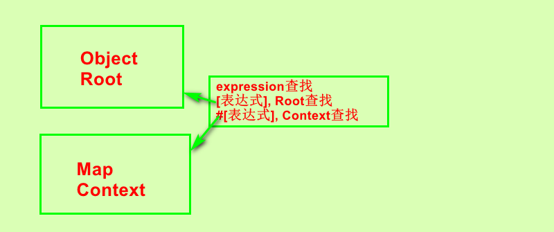

[TOC]

# OGNL概述

> OGNL(Object-Graph Navigation Language), 强大的表达式语言, 通过简单一致的表达式, 仅以存取对象的任意属性, 调用对象方法, 遍历整个对象的结构图, 实现字段类型转换等, 使用相同的表达式存取对象属性;

## 作用

1. 支持对象方法的调用, objName.nethodName().
2. 支持静态方法调用和值的访问, 表达式的格式@[类全名(包括路径)]@[方法名 | 值名]
   例如: @java.lang.String@format('foo %s', 'bar');
3. 支持赋值操作和吊打是串联.
   例如: price=100, discount=0.8, calculatePrice(), 在方法中计算返回80;
4. 访问OGNL上下文(OGNL contest)和 ActionContext;
5. 操作集合对象;

## 要素

>  OGNL的操作实际上是围绕3要素进行的, 表达式(Expression), 根对象(Root Object), 上下文环境(Context).

### 表达式

1. 整个OGNL的核心, OGNL会根据表达式去对象中取值. 所有OGNL都是根据表达式解析后进行的;
2. 是一个带有语法含义的字符串, 表明此次要做什么. 支持'链式', 还支持简单的表达式计算 ;

### 根对象

1. Root对象可以理解为OGNL操作对象, Root对象规定了"对谁操作";
2. 对象图: 即以任何一个对象为根, 通过OGNL可以访问与这个对象关联的其他对象;

### Context对象

1. OGNL还需要一个上下文环境. 
2. 设置了Root对象, OGNL对Root进行操作取值或写值操作, Root对象所在环境就是OGNL的上下文环境(Context);
3. 上下文环境Context是一个Map类型的对象, 在表达式中**访问Context中的对象**, 需要使用"#"号加上对象名称即可, 即"#对象名称"的形式;

## 入门使用

```java
//OGNL调用对象的方法;
    @Test
    public void demo1() throws OgnlException {
        OgnlContext ognlContext = new OgnlContext();
        Object obj = Ognl.getValue("'HelloWord'.length()", ognlContext, ognlContext.getRoot());
        System.out.println("length: " + obj);
    }
```

```java
//OGNL调用对象的静态方法
    @Test
    public void demo2() throws OgnlException{
        OgnlContext ognlContext = new OgnlContext();
        Object obj = Ognl.getValue("@java.lang.Math@random()", ognlContext, ognlContext.getRoot());
        System.out.println("Math random(): " + obj);
    }
```

```java
//OGNL获取Root中的值
    @Test
    public void demo3() throws OgnlException{
        OgnlContext ognlContext = new OgnlContext();
        User user1 = new User();
        user1.setUserName("jackblue1");
        user1.setPassword("123456");
        user1.setAge(21);
        user1.setSex("男");
        User user2 = new User();
        user2.setUserName("jackblue2");
        user2.setPassword("223456");
        user2.setAge(21);
        user2.setSex("男");
        Map<String, User> userMap = new HashMap<>();
        userMap.put("user1", user1);
        userMap.put("user2", user2);
        ognlContext.setRoot(userMap);
        Object obj = Ognl.getValue("user2.userName", ognlContext, ognlContext.getRoot());
        System.out.println("user#userName: " + obj);
    }
```

```java
 //OGNL获取Context中的值
    @Test
    public void demo4() throws OgnlException{
        OgnlContext ognlContext = new OgnlContext();
        User user1 = new User();
        user1.setUserName("jackblue1");
        user1.setPassword("123456");
        user1.setAge(21);
        user1.setSex("男");
        ognlContext.put("user1", user1);
        //获取上下文环境的值没有添加'#'发生异常;
        // Object obj = Ognl.getValue("user1.userName", ognlContext, ognlContext.getRoot());
        Object obj = Ognl.getValue("#user1.userName", ognlContext, ognlContext.getRoot());
        System.out.println("user#userName: " + obj);
    }
```

## 简单分析 abstract OGNL类

1. 他是Apache提供的一个工具类, 用于使用表达式去除Root和Context中的数据的类;
2. 他会通过算法, 一层一层的搜寻已知的对象, 如果没有找到发生异常;

```java
Ognl类, 通过使用表达式获取root, context中的数据
/**
 * <P>
 * This class provides static methods for parsing and interpreting OGNL expressions.
 * </P>
 * <P>
 * The simplest use of the Ognl class is to get the value of an expression from an object, without
 * extra context or pre-parsing.
 * </P>
 ...
 */
类方法, 所以可以此表达式获取值;
: context中的对象使用#[表达式的形式], 如context中的User, #user.userName;
: root中的对象: user.userName;
 public static Object getValue(String expression, Map context, Object root)
            throws OgnlException
    {
        return getValue(expression, context, root, null);
    }
 /**
     * Evaluates the given OGNL expression to extract a value from the given root object in a given
     * context
     * @see #parseExpression(String)
     * @see #getValue(Object,Object)
     * @param expression
     *            the OGNL expression to be parsed
     * @param context
     *            the naming context for the evaluation
     * @param root
     *            the root object for the OGNL expression
     * @return the result of evaluating the expression
     ...
*/
```



# struts2值栈

> ValueStack是一个接口, 字面意义为值栈. OgnlValueStack是ValueStack的实现类.
>
> 客户端发起一个请求, 客户端会创建一个Action外同样会创建一个OgnlValueStack实例.
>
> OgnlValueStack贯穿整个Action声明周期, 模型驱动使用Ognl将请求数据封装到值栈中.

## OgnlValueStack类简介

```java
/**
 * Ognl implementation of a value stack that allows for dynamic Ognl expressions to be evaluated against it. When evaluating an expression,
 * the stack will be searched down the stack, from the latest objects pushed in to the earliest, looking for a bean with a getter or setter
 * for the given property or a method of the given name (depending on the expression being evaluated).
 *
 * @author Patrick Lightbody
 * @author tm_jee
 * @version $Date$ $Id$
 */
public class OgnlValueStack implements Serializable, ValueStack, ClearableValueStack, MemberAccessValueStack;
> 他实现了Ognl的思想, 可以使用表达式获取root与context的值;

protected CompoundRoot root;(继承ArrayList具有栈的特点)
protected transient Map<String, Object> context;
两个对象, 他们分别是模拟栈 Root, 和Map context;
```

## 值栈的存储结构

1. 临时对象: 该对象在执行过程中由容器自动创建并创建并保存到值栈中. 该对象值不固定, 会随着应用发生变化(Ognl标签迭代输出时, 这些值会以这种形式出现);(Ognl root , 在struts2为CompoundRoot implement List)
2. 模型对象: action使用模型驱动的时候被创建;(Ognl root , 在struts2为CompoundRoot implement List)
3. Action对象, 每次请求都会保存一个action的引用信息, 保存了内部执行信息, 和属性驱动保存的值;(Ognl root , 在struts2为CompoundRoot implement List)
4. 命名对象: 保存了很多key-value对象是一个Map类型数据,(Ognl Context);

## 内部结构

### ValueStackContents部分(CompoundRoot部分)


1. 作为OgnlContext的Root对象, CompoundRoot继承了ArrayList, 拥有栈的特点;
2. 在root部分, 包含了本次创建的Action对象;
3. 如果是模型驱动, 还会包含请求数据封装成为的pojo对象;
4. 查找时, 会在栈顶查找对应的属性, 如果找到则返回, 如果找不到则继续找栈中的其他对象, 如果找到就停止;

### stackContext部分(context部分)


1. 作为OgnlContext的上下文, 他是一个Map结构;
2. 里面保存了一些引用, parameters, request, session, application等;
   1. parameters: 该Map保存了request对象中的所有属性;
   2. request: 该Map保存了request对象中的所有属性;
   3. session: 该Map保存了session对象中的所有属性;
   4. application: 该map保存了application中所有属性;
   5. attr:  该map按request, session, application来检索属性;

## ActionContext与ValueStack的关系

> PrepareOperations类中创建ActionContext的方法;

```java
/**
     * Creates the action context and initializes the thread local
     *
     * @param request servlet request
     * @param response servlet response
     *
     * @return the action context
     */
    public ActionContext createActionContext(HttpServletRequest request, HttpServletResponse response) {
        ActionContext ctx;
        Integer counter = 1;
        Integer oldCounter = (Integer) request.getAttribute(CLEANUP_RECURSION_COUNTER);
        if (oldCounter != null) {
            counter = oldCounter + 1;
        }
        
        ActionContext oldContext = ActionContext.getContext();
        if (oldContext != null) {
            // detected existing context, so we are probably in a forward
            ctx = new ActionContext(new HashMap<>(oldContext.getContextMap()));
            //没有即创建ActionContext
        } else {
            ValueStack stack = dispatcher.getContainer().getInstance(ValueStackFactory.class).createValueStack();
            stack.getContext().putAll(dispatcher.createContextMap(request, response, null));
            //将valueStack的环境创建ValueStack;  1
            ctx = new ActionContext(stack.getContext());
        }
        request.setAttribute(CLEANUP_RECURSION_COUNTER, counter);
        //与当前线程绑定的actionContext;  2
        ActionContext.setContext(ctx);
        return ctx;
    }

/**
* Gets the context for this value stack. The context holds all the information in the value stack and it's surroundings.
*
* @return  the context.
*/
    public abstract Map<String, Object> getContext();  1

/**
     * Sets the action context for the current thread.
     *
     * @param context the action context.
     */
    public static void setContext(ActionContext context) {  2 
        actionContext.set(context);
    }
```

1. 在1处, 创建ActionContext时, 将值栈的所有信息的map设置进了ActionContext;
2. 在2处, 将创建号的ActionContext与线程绑定;
3. 在创建ActionContext时创建ValueStack对象, 将ValueStack放入ACtionContext对象;
4. 他们之间都有相互的引用, 并且ActionContext获取ServletAPI依赖值栈;

## 值栈对象的基本操作

### 获取值栈对象

1. 使用ActionContext获取值栈

   ```java
   ValueStack stack = ActionContext.getContext().getValueStack();
   ```

2. 使用Request对象获取值栈

   1. \<s:debug/\>标签, Stack Context中的数据

      ```java
      {struts.actionMapping=ActionMapping{name='action1_execute'
       namespace='/'
       method='null'
       extension='null'
       params={}
       result=null}
       javax.servlet.forward.context_path=/StrutsDay03_OGNL_war_exploded
       //值栈的引用
       struts.valueStack=com.opensymphony.xwork2.ognl.OgnlValueStack@357ae894
       struts.request_uri=/StrutsDay03_OGNL_war_exploded/action1_execute
       javax.servlet.forward.servlet_path=/action1_execute
       javax.servlet.forward.request_uri=/StrutsDay03_OGNL_war_exploded/action1_execute
       .freemarker.TemplateModel={request=org.apache.struts2.dispatcher.StrutsRequestWrapper@65f6ff7d
       stack=com.opensymphony.xwork2.ognl.OgnlValueStack@357ae894
       ognl=org.apache.struts2.views.jsp.ui.OgnlTool@16ff004
       Parameters=freemarker.ext.servlet.HttpRequestParametersHashModel@23962273
       session=org.apache.catalina.session.StandardSessionFacade@633386f5
       Request=freemarker.ext.servlet.HttpRequestHashModel@359e6703
       themeProperties={parent=simple}
       JspTaglibs=freemarker.ext.jsp.TaglibFactory@7124b55a
       s=org.apache.struts2.views.freemarker.tags.StrutsModels@237bb114
       response=org.apache.catalina.connector.ResponseFacade@7aae183a
       struts=org.apache.struts2.util.StrutsUtil@5dea9aaf
       action=top.blueli.controller.Action@2211abc9
       tag=org.apache.struts2.components.Debug@764b44b4
       Application=freemarker.ext.servlet.ServletContextHashModel@8c6b878
       Session=freemarker.ext.servlet.HttpSessionHashModel@170742d
       .freemarker.RequestParameters=freemarker.ext.servlet.HttpRequestParametersHashModel@23962273
       base=/StrutsDay03_OGNL_war_exploded}
       __cleanup_recursion_counter=1
       .freemarker.RequestParameters=freemarker.ext.servlet.HttpRequestParametersHashModel@23962273
       struts.view_uri=/result.jsp
       javax.servlet.forward.mapping=org.apache.catalina.core.ApplicationMapping$MappingImpl@1ce1986c
       .freemarker.Request=freemarker.ext.servlet.HttpRequestHashModel@359e6703} (class org.apache.struts2.dispatcher.RequestMap)
      ```

      2. 获取值栈, 业务流程发送表单User类->模型驱动封装->action获取值栈顶元素(即User)并打印;

         ```java
         @Override
             public String execute() throws Exception {
                 ValueStack valueStack = (ValueStack) ServletActionContext.getRequest().getAttribute("struts.valueStack");
                 System.out.println(valueStack.getClass().getName());
                 Object object = valueStack.pop();
                 if (object instanceof User) {
                     System.out.println((User)object);
                 }
                 return SUCCESS;
             }
         ```

### 向值栈放入数据

1. 可以使用ActionContext中的实例方法put向stackContext放入Key-Value数据;
2. 使用ValueStack的实例方法set(String, Object), put(Object)放入数据(放入root部分, 即CompoundRoot的栈顶);


3. 使用struts2标签的\<s:push\>标签, 但只有在变迁内部可用;

### 页面获取值栈的值

1. 在Action中可以使用ValueStack实例方法pop(), peek()获取栈顶数据, 还可以使用获取Root根对象等;
2. 在jsp页面使用Ognl表达式可以获取值栈对象;
   1. ValueStack Contents: 
      1. 使用的是set(String, Object), 放入的数据直接使用key获取数据;
      2. 使用的是push()方法放入数据[0].top获取栈顶, [1].top栈顶下一个元素.(在Ognl使用top代表ValueStack的Root);

```java
--------------------------------------------------------------------客户请求------------------------------------------------------
POST http://localhost:8080/StrutsDay03_OGNL_war_exploded/action1_execute
Content-Type: application/x-www-form-urlencoded

-----------------------------------------------------------------Action响应部分---------------------------------------------------
//Action类
package top.blueli.controller;

import com.opensymphony.xwork2.util.ValueStack;
import org.apache.struts2.ServletActionContext;

public class Action extends ActionSupport{
    @Override
    public String execute() throws Exception {
        ValueStack valueStack = ActionContext.getContext().getValueStack();
        //放入stackContext部分
        ActionContext.getContext().put("ActionContextPutKey", "ActionContextObject");
        valueStack.set("ValueStackSetKey", new String("ValueStackSetObject"));
        valueStack.push("pushInValueStack1");
        valueStack.push("pushInValueStack2");
        return SUCCESS;
    }
}
//映射配置
    <package name="package1" extends="struts-default" namespace="/">
        <action name="action1_*" class="top.blueli.controller.Action" method="{*}">
            <result>/result.jsp</result>
        </action>
    </package>

-----------------------------------------------------------------jsp部分---------------------------------------------------------
<h1>获取值栈中的值</h1>
<h2>ActionContext的put方法放入的值</h2>
<ul>
    <li>获取Context的值必须使用#号作为引用</li>
    <li><s:property value="%{#ActionContextPutKey}" default="null"/></li>
</ul>
<h2>ValueStack使用set(String, Object)方法,key-value</h2>
<ul>
    <li><s:property value="%{ValueStackSetKey}" default="null"/></li>
</ul>
<h2>push方法</h2>
<ul>
    <li>栈顶. <s:property value="[0].top" default="null"/></li>
    <li>栈顶下一个. <s:property value="[1].top" default="null"/></li>
</ul>

-----------------------------------------------------------------运行结果---------------------------------------------------------
<h1>获取值栈中的值</h1>
<h2>ActionContext的put方法放入的值</h2>
<ul>
    <li>获取Context的值必须使用#号作为引用</li>
    <li>ActionContextObject</li>
</ul>
<h2>ValueStack使用set(String, Object)方法,key-value</h2>
<ul>
    <li>ValueStackSetObject</li>
</ul>
<h2>push方法</h2>
<ul>
    <li>栈顶. pushInValueStack2</li>
    <li>栈顶下一个. pushInValueStack1</li>
</ul>
```


# EL

## EL访问值栈

```java
public class StrutsRequestWrapper extends HttpServletRequestWrapper{};
```

1. strtus2对值栈的getAttribute进行增强, 所以可以访问值栈内容使用ValueStack的findValue(key), 使用Ognl获取值栈内容;

## EL特殊字符

### '#'号

1. 
2. Ognl访问Context内容时必须使用此符号;
   如访问context的request对象的值 #request.User;

### '%'符号

1. 强制解析为Ognl表达式

### '$'符号

1. 在xml文件中或配置文件中使用;

# 总结

1. Ognl概述
   1. Ognl是什么, 有什么用;
   2. Ognl的3个要输是什么, 有什么用;
   3. Ognl的Expression表达式如何使用;
2. 值栈
   1. 值栈是什么, 它有什么用, 和servlet比较, 和request的关系;
   2. 值栈如何存放数据, 和标签的关系, 指值栈有那两部分;
   3. 如何向值栈放入数据, Action中放入, ValueStack, ActionContext, jsp页面;
   4. 如何在值栈取出数据, Action中取出, ValueStack, ActionContext.  jsp取出ValueStackRoot数据, 取出StackContext的值, 取出不同字段, pojo对象, 集合(list, map, set);
   5. El特殊符号的运用;