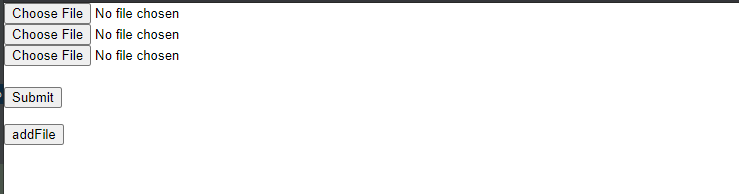
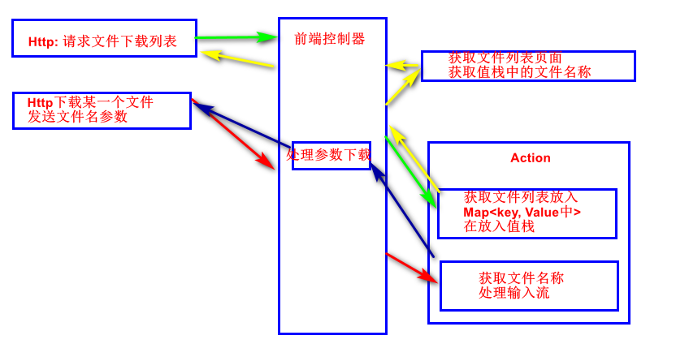

[TOC]

# Struts2文件上传

## Http提交数据配置

### from表单enctype属性值

| 编号 | 取值                              | 描述                                                         |
| ---- | --------------------------------- | ------------------------------------------------------------ |
| 1    | application/x-www-from-urlencoded | 默认, 在发送前对所有字符进行编码(将空格转换为"+"符号, 将特殊字符转化为ASCLL HEX值) |
| 2    | multipart/form-data               | 不对字符进行编码. 当在**文件上传**时必须使用                 |
| 3    | text/plain                        | 将空格转换为"+", 但不编码其他字符                            |

### form表单格式

1. 提交表单method必须是post, enctype必须是multpart/form-data;
2. 表单项必须使用type为file, name为xxx随意(与Action中属性驱动注入数据有关);
3. 使用javaScript实现动态添加表单元素, 实现多文件上传

```jsp
--------------------------------------------------------------fileUpload.jsp----------------------------------------------------
<%--
  Created by IntelliJ IDEA.
  User: 19146
  Date: 2020/6/22
  Time: 19:24
  To change this template use File | Settings | File Templates.
--%>
<%@ page contentType="text/html;charset=UTF-8" language="java" %>
<html>
<head>
    <title>文件上传</title>
</head>
<body>
    <form action="<%=request.getContextPath()+"/"%>action1_execute" method="post" enctype="multipart/form-data">
        <div id="fileGroup">
            <input type="file" name="uploadFile"/>
        </div>
        <br/>
        <input type="submit" onclick="addFile()"/>
    </form>
    <button id="appendFile">addFile</button>
<%--    动态添加文件域实现多文件上传--%>
    <script>
        let button = document.getElementById('appendFile');
        let fileGroup = document.getElementById('fileGroup');
        button.addEventListener('click', function () {
            let input = document.createElement('input');
            let br = document.createElement('br');
            input.type='file';
            input.name='uploadFile';

            fileGroup.append(br);
            fileGroup.append(input);
            return true;
        })
    </script>
</body>
</html>
```



## Action单元配置

### 相关常量配置
1. 常量Struts2常量: struts2-core-2.5.16.jsp下, org.apache.struts2.default.properties是全部的常量配置;
   1. 一个时临时文件存放位置, 一个时全局的文件位置;

```properties
# uses javax.servlet.context.tempdir by default
# 临时文件保存目录, 默认在..., 在window/temp, 在程序运行磁盘e:/temp下
struts.multipart.saveDir=
# 全局的文件大小, 上传文件必须小于maxSize
struts.multipart.maxSize=2097152
```

2. 文件无法上传并报奇怪的错误, Could not find action or result:
   1. 因为未配置\<result name="input"\>/error.jsp\</result\>页面, 导致拦截器在出现文件上传异常时返回的数据没有被正确处理;
   2. 导致问题的原因是文件大小超过配置大小, 获取类型不匹配.

```xml
15:01:04.070 [http-nio-8080-exec-275] ERROR org.apache.struts2.dispatcher.Dispatcher - Could not find action or result: /StrutsDay04_fileUpLoadAndDownLoad_war_exploded/action1_execute
com.opensymphony.xwork2.config.ConfigurationException: No result defined for action top.blueli.controller.FileUpload and result input
	at com.opensymphony.xwork2.DefaultActionInvocation.executeResult(DefaultActionInvocation.java:377) ~[struts2-core-2.5.16.jar:2.5.16]
	at com.opensymphony.xwork2.DefaultActionInvocation.invoke(DefaultActionInvocation.java:279) ~[struts2-core-2.5.16.jar:2.5.16]
  ...
```

### 文件大小与文件类型拦截与错误页面配置

1. 当拦截器发线文件不符合配置要求时他会返回一个'input'字符串, 所以可以使用此来配置错误处理页面;
2. allowedTypes属性值: [Struts2文件上传拦截器allowedTypes属性](https://app.yinxiang.com/shard/s22/nl/27190308/fa50b509-8f04-4714-ac91-bcb3a131defb)

```xml-dtd
------------------------------------------------常量配置--------------------------------------------------------------------------
...
<!--    文件上传大小控制
		1. 控制全局的文件大小, 规定上传的文件不可以大于maxSize;
-->
<constant name="struts.multipart.maxSize" value="20971520000"></constant>
...

---------------------------------------------拦截器配置---------------------------------------------------------------------------
...
        <action name="action1_*" class="top.blueli.controller.FileUpload" method="{1}">
            <interceptor-ref name="fileUpload">
<!--                1. 配合上面maxSize, maximumSize<maxSize, 突破2m限制(可以不配置)
					2. 允许上传的文件类型(可以不配置)
					3. 他是对文件上传的动态增强, 可以不配置, 如果配置一定要配置默认的拦截器
-->
					<param name="allowedTypes">*</param>
					<param name="maximumSize">2097152000</param>
            </interceptor-ref>
            <interceptor-ref name="defaultStack" />
            <result>/result.jsp</result>
			<result neme="input">/error.jsp</result>
        </action>
...
```

### 文件上传Action代码

1. 定义字段: 
   1. File类型的数组或集合, 代表上传的文件, 名称为xxx;
   2. String类型的数组或集合, 代表上传的文件名, 名称为xxxFileName;
   3. String类型的数组或集合, 代表上传文件的类型, 名称为xxxFileContentType;
   4. 它依赖默认的拦截器链, 将以属性驱动的形式保存到Action中;

```xml
如果表单为: 
<form action="" method="post" enctype="multipart/from-data">
	<input type="file" name="feilUp"/>
	<input type="file" name="feilUp"/>
	<input type="file" name="feilUp"/>
</form> 

action字段为: 
private File[] fileUp;
private String[] fileUpFileName;
private String[] fileUpFileContentType;
```

2. 提供getter/setter方法
3. action处理文件并保存到指定路径;

```java
-------------------------------------------------------Action配置----------------------------------------------------------------
package top.blueli.controller;

import com.opensymphony.xwork2.ActionSupport;
import org.apache.struts2.ServletActionContext;

import java.io.File;
import java.io.FileInputStream;
import java.io.FileOutputStream;
import java.util.Arrays;


public class FileUpload extends ActionSupport {
    private File[] uploadFile;
    private String[] uploadFileFileName;
    private String[] uploadFileContentType;

    @Override
    public String execute(){
        //打印文件上传文件名
        System.out.println(Arrays.toString(uploadFileFileName));
        //获取程序运行的绝对路径, 保存文件
        File fileDir = new File(ServletActionContext.getServletContext().getRealPath("/upload"));
        if (!fileDir.exists()){
            fileDir.mkdirs();
        }

        for(int i = 0; i < uploadFile.length; i++) {
            try{
                //创建文件保存上传文件
                File outFile = new File(fileDir.getPath()+"\\"+uploadFileFileName[i]);
                if (!outFile.exists()){
                    outFile.createNewFile();
                }
                //文件输入流, 即上传的文件
                FileInputStream inputStream = new FileInputStream(uploadFile[i]);
                //文件输出流, 保存上传文件到指定目录
                FileOutputStream outputStream = new FileOutputStream(outFile);
                byte[] b = new byte[10240*1024];
                int pos=-1;
                while((pos = inputStream.read(b)) > -1) {
                    outputStream.write(b, 0, pos);
                }
                outputStream.close();
                inputStream.close();
            }catch (Exception e) {
                e.printStackTrace();
            }
        }
        return SUCCESS;
    }
	//getter,setter...
}

```

```xml-dtd
-------------------------------------------------------映射配置----------------------------------------------------------------
 <!--配置默认字符集为UTF-8-->
    <constant name="struts.i18n.encoding" value="UTF-8"/>
    <!--配置开启开发模式-->
    <constant name="struts.devMode" value="true"/>
    <!--设置action请求的拓展名-->
    <constant name="struts.action.extension" value="action,do,"/>
    <!--配置开启动态方法调用-->
    <constant name="struts.enable.DynamicMethodInvocation" value="false"/>
<!--    文件上传大小控制-->
    <constant name="struts.multipart.maxSize" value="20971520000"></constant>
<!--	配置临时文件路径-->
<!--    <constant name="struts.multipart.saveDir" value="/temp"></constant> -->
    
     <package name="package1" extends="struts-default" namespace="/">
        <action name="action1_*" class="top.blueli.controller.FileUpload" method="{1}">
            <interceptor-ref name="fileUpload">
<!--			配置允许上传文件类型-->
                <param name="allowedTypes">*</param>
<!--                配合上面maxSize, maximumSize<maxSize, 突破2m限制-->
<!--                <param name="maximumSize">2097152000</param>-->
            </interceptor-ref>
            <interceptor-ref name="defaultStack" />
            <result>/result.jsp</result>
<!--		在文件大小超过限制, 文件类型不匹配时跳转的页面-->
            <result name="input">/error.jsp</result>
        </action>
    </package>
```

```jsp
jsp页面
----------------------------------------------------result.jsp-----------------------------------------------------------------
<%--
  Created by IntelliJ IDEA.
  User: 19146
  Date: 2020/6/22
  Time: 19:26
  To change this template use File | Settings | File Templates.
--%>
<%@ page contentType="text/html;charset=UTF-8" language="java" %>
<%@ taglib prefix="s" uri="/struts-tags" %>
<html>
<head>
    <title>文件上传成功</title>
</head>
<body>
<h1>文件上传成功</h1>
    <s:debug/>
</body>
</html>
----------------------------------------------------error.jsp------------------------------------------------------------------
<%--
  Created by IntelliJ IDEA.
  User: 19146
  Date: 2020/6/23
  Time: 15:56
  To change this template use File | Settings | File Templates.
--%>
<%@ page contentType="text/html;charset=UTF-8" language="java" %>
<html>
<head>
    <title>error</title>
</head>
<body>
    <h1>文件大小或类型不匹配</h1>
</body>
</html>
```

## 文件上传总结

1. 注意表单的配置, 需要注意method, enctype两个属性的取值;
2. Action类需要注意获取文件路径相关的问题, 如获取程序允许相对路径的方式

```java
File fileDir = new File(ServletActionContext.getServletContext().getRealPath("/upload"));
 //创建文件保存上传文件
File outFile = new File(fileDir.getPath()+"\\"+uploadFileFileName[i]);
```

3. 映射配置注意3个地方, 常量(临时目录, 文件上传大小限制), 文件上传拦截器(类型限制, 文件大小拦截), 错误页面配置(input字符串, 要不然报错);

# Struts2文件下载

## 获取文件列表

1. 因为时小demo, 没有向写的很复杂, 所以, 获取文件列表使用File类读取context/upload文件夹下的所有文件, 并显示到页面上;

## 处理下载

2. 在\<result\>的\<param\>给response写入数据实现文件下载;

## Action中的配置

```java
-----------------------------------------------获取文件列表与的下载文件的action类:----------------------------------------------------
package top.blueli.controller;

import com.opensymphony.xwork2.ActionContext;
import com.opensymphony.xwork2.ActionSupport;
import org.apache.struts2.ServletActionContext;

import java.io.File;
import java.io.FileInputStream;
import java.io.FileNotFoundException;
import java.io.UnsupportedEncodingException;
import java.util.Arrays;
import java.util.HashMap;
import java.util.Map;

public class FileDownload extends ActionSupport {
    private FileInputStream inputStream;
    private String fileName;

    //获取文件列表
    @Override
    public String execute() throws Exception {
        //查找根目录下的文件, 将文件封装到Map<String, Map<String, String>>中;
        File file = new File(ServletActionContext.getServletContext().getRealPath("/upload"));
        String[] fileNames = file.list();
        Map<String, String> fileMap = new HashMap<>();
        for(int i = 0; i < fileNames.length; i++) {
            fileMap.put(fileNames[i], file.getPath()+"/"+file);
        }
        System.out.println("文件名称:" + Arrays.toString(fileNames));
        ActionContext.getContext().getValueStack().set("fileMap", fileMap);
        return SUCCESS;
    }
    //下载文件
    public String download() {
        //打印文件路径
        System.out.println(ServletActionContext.getServletContext().getRealPath("/upload")+"/"+fileName);
        //创建输入流, 给下载做准备
        try {
            inputStream = new FileInputStream(ServletActionContext.getServletContext().getRealPath("/upload")+"/"+fileName);
        } catch (FileNotFoundException e) {
            e.printStackTrace();
        }
        return "download";
    }

    public FileInputStream getInputStream() throws UnsupportedEncodingException {
        return inputStream;
    }

    public void setInputStream(FileInputStream inputStream) {
        this.inputStream = inputStream;
    }

    //此方法获取文件名称, 转码可以避免中文文件乱码
    public String getFileName() throws UnsupportedEncodingException {
        if (fileName != null)
            fileName = java.net.URLEncoder.encode(fileName, "UTF-8");
        return fileName;
    }

    public void setFileName(String fileName) {
        this.fileName = fileName;
    }

}
```

```xml-dtd
--------------------------------------------------------映射配置文件---------------------------------------------------------------
    <package name="package1" extends="struts-default" namespace="/">
<!--		动态方法调用, execute()获取文件列表, download()获取输出流, 下载文件-->
        <action name="action2_*" class="top.blueli.controller.FileDownload" method="{1}" >
            <result name="success" type="dispatcher">/fileList.jsp</result>
            <result name="download" type="stream">
                <param name="contentType">application/octet-stream;charset=ISO8859-1</param>
                <param name="inputStream">inputStream</param>
                <param name="contentDisposition">attachment;filename=${fileName}</param>
                <param name="bufferSize">1024</param>
            </result>
        </action>
    </package>
```

```jsp
----------------------------------------------------------文件列表jsp文件----------------------------------------------------------
<%--
  Created by IntelliJ IDEA.
  User: 19146
  Date: 2020/6/22
  Time: 21:56
  To change this template use File | Settings | File Templates.
--%>
<%@ page contentType="text/html;charset=UTF-8" language="java" %>
<%@taglib prefix="s" uri="/struts-tags" %>
<html>
<head>
    <title>文件下载列表</title>
</head>
<body>
<h1>选择下载的文件</h1>
<table border="2px">
    <!--使用struts2标签, 获取map中的集合获取数据-->
    <s:iterator value="fileMap">
        <tr>
            <td>文件名称: </td>
            <td><s:property value="key"/> </td>
            <td><a href="<%=request.getContextPath()+'/'%>action2_download?fileName=<s:property value="key"/>">下载</a> </td>
        </tr>
    </s:iterator>
</table>
<s:debug/>
</body>
</html>
```

## 处理大概流程



## 处理下载中文乱码问题

1. 在获取文件名称的get方法使用转码即可;

```java
...
//此方法获取文件名称, 转码可以避免中文文件乱码
public String getFileName() throws UnsupportedEncodingException {
if (fileName != null)
fileName = java.net.URLEncoder.encode(fileName, "UTF-8");
return fileName;
}
...
```

## 总结

1. 获取输入流, 使用配置的方式下载文件;
2. 与使用response对象的方式实现下载方便了, 不需要将数据写入ServletOutputStream对象, 不需要配置响应头, 更加方便了;